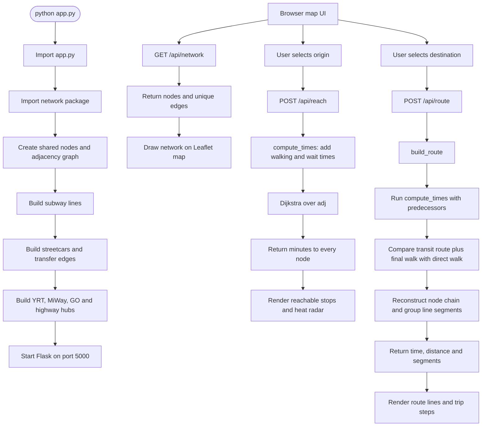

# Toronto Transit Reach

A local Flask app — no API key, no billing account. Classic OpenStreetMap
tiles in the browser; every travel time, route, and heat-radar point is
computed by a Python routing engine.

## Run it

```bash
pip install -r requirements.txt
python app.py
```

Open **http://127.0.0.1:5000**.

## Project layout

```
toronto_transit/
├── app.py                 Flask entry point — just the 3 routes
├── routing.py              Dijkstra reachability + trip building
├── network/
│   ├── __init__.py         builds the graph in dependency order
│   ├── graph.py             add_node / add_edge / chain primitives
│   ├── subway.py            TTC Line 1 + Line 2 + their extensions
│   ├── streetcars.py        downtown streetcar grid + subway transfers
│   └── regional.py          YRT/Viva, MiWay, highway-corridor hubs
├── templates/
│   └── index.html          page shell (Jinja)
├── static/
│   ├── css/style.css        all styling
│   └── js/app.js            map rendering, heat radar, fetch calls
├── requirements.txt
└── README.md
```

Each piece is independently readable: `network/subway.py` only knows
about subway stations, `routing.py` only knows about graph search, and
`app.py` only knows about HTTP. None of them import Flask except
`app.py`, and none of them know about Leaflet — that all lives in
`static/js/app.js`.

## Python workflow



## Endpoints

- `GET /api/network` — the full graph (nodes + edges), fetched once on
  page load to draw the line outlines and seed the heat radar.
- `POST /api/reach` `{lat, lon}` — reachability from a point, in
  minutes to every stop. Powers the heat-map / time-filter mode.
- `POST /api/route` `{olat, olon, dlat, dlon}` — a full point-to-point
  trip: walk → transit legs → walk, with time and real distance (km)
  per leg and in total.

## What's fixed vs. what could be upgraded

This is a fixed schedule *model* (typical dwell/wait/transfer minutes),
not TTC's live feed — TTC's public real-time (GTFS-RT) feed was
retired, and this environment has no network access to pull a live
GTFS static feed either. To swap in real GTFS data, replace the station
lists in `network/subway.py` / `streetcars.py` / `regional.py` with a
GTFS parser that builds the same shape of data (a list of
`{id, name, lat, lon}` dicts per line, fed through `chain()`).
