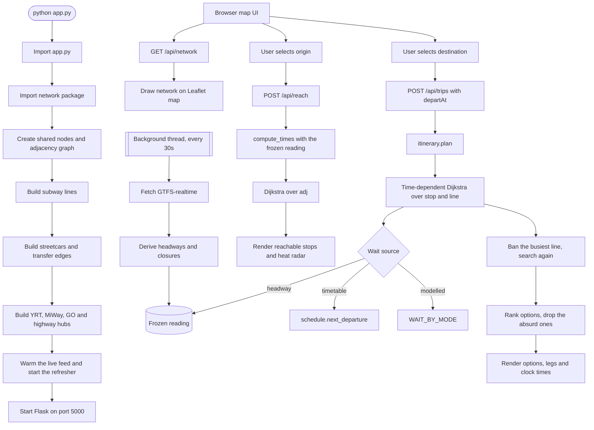

# Toronto Transit Reach

[](https://github.com/luke-zhang-cs-py/Toronto-Transit-Distance-Matrix/actions/workflows/python-package-conda.yml)
[](LICENSE)
[](https://www.python.org/)

**[Read the overview →](https://luke-zhang-cs-py.github.io/Toronto-Transit-Distance-Matrix/)**
— where each number comes from and how much to trust it, the graph it
searches, and every bug this thing has had.

A local Flask app that answers three questions about getting around Toronto:
how far you can get in a given time, how to make a particular trip, and what
time you will actually arrive.

**No API key, no billing account.** Classic OpenStreetMap tiles in the
browser, and every travel time is computed here — against TTC's own
timetable and its live service feed, both of which are open.

## Run it

```bash
pip install -r requirements.txt
python app.py
```

Open **http://127.0.0.1:5000**.

For timetabled departures, build the schedule index once:

```bash
python tools_build_schedule.py
```

Everything works without it, on live headways and modelled waits, and every
response says which it used.

## Where the numbers come from

This matters more than it sounds, because three different kinds of number
appear on the same screen and they do not deserve equal confidence. Every
wait carries its source, and the page shows it.

| | Source | Covers |
|---|---|---|
| **timetable** | TTC static GTFS, via `schedule_index.json` | Both subway lines, six streetcar routes — the next actual departure |
| **headway** | TTC GTFS-realtime, live | Surface routes — half the observed gap between vehicles |
| **modelled** | `WAIT_BY_MODE` | YRT, MiWay, GO — half an assumed headway |

Live service alerts are applied on top: a closed line is dropped from the
graph so trips route around it, and a detour costs time.

**Still modelled everywhere:** the ride time between stops. GTFS has those
too, but this graph is a hand-built simplification whose edges skip stops, so
a scheduled hop would not describe the same journey. Improving that means
rebuilding the graph from GTFS rather than patching the times onto it.

## Project layout

```
toronto_transit/
├── app.py                  Flask entry point — HTTP and nothing else
├── routing.py              Dijkstra reachability, for the heat map
├── itinerary.py            trips for a departure time, with clock times
├── schedule.py             "when does the next one leave", from the timetable
├── realtime.py             live waits and closures from GTFS-realtime
├── tools_build_schedule.py one-shot: 207 MB of GTFS -> a 0.6 MB index
├── network/
│   ├── __init__.py         builds the graph in dependency order
│   ├── graph.py            add_node / add_edge / chain primitives
│   ├── subway.py           TTC Line 1 + Line 2 + their extensions
│   ├── streetcars.py       downtown streetcar grid + subway transfers
│   └── regional.py         YRT/Viva, MiWay, highway-corridor hubs
├── templates/index.html    page shell (Jinja)
├── static/
│   ├── css/style.css       all styling
│   └── js/app.js           map rendering, heat radar, trip options
├── tests/                  the suite; fixtures instead of the network
│   └── fixtures/           recorded GTFS-realtime feeds, so tests need no network
├── requirements.txt
└── README.md
```

Each piece is independently readable. `network/subway.py` only knows about
stations, `routing.py` only knows about graph search, `app.py` only knows
about HTTP. Nothing imports Flask except `app.py`, and nothing knows about
Leaflet except `static/js/app.js`.

## Endpoints

- `GET /api/network` — the full graph (nodes + edges), fetched once on page
  load to draw the line outlines and seed the heat radar.
- `POST /api/reach` `{lat, lon}` → `{times: {node_id: minutes}, live}` —
  reachability from a point. Powers the heat map and the time filter.
- `POST /api/route` `{olat, olon, dlat, dlon}` — one trip as a duration, with
  time and real distance per leg. What the map draws.
- `POST /api/trips` `{olat, olon, dlat, dlon, departAt?, alternatives?, later?}`
  — several ways to make the trip, each with clock times. `departAt` takes
  `"17:20"`, an ISO timestamp, or `"now"`.
- `GET /api/live` — feed freshness, current closures, and what is covered by
  the timetable versus modelled.

Both POST bodies accept `"live": false` to force the fixed schedule model,
which is what the tests use and what you want when comparing two trips
without the ground moving between them.

### A trip, for a specific time

```
POST /api/trips  {"olat":43.6453,"olon":-79.3806,
                  "dlat":43.7805,"dlon":-79.4151,"departAt":"17:20"}

OPTION 1   17:20 -> 18:00   41 min, direct
  or leave on the 17:24, 17:27, 17:29

  17:20-17:22   wait for Line 1, board 17:22   (timetabled)
  17:22-18:00   ride Line 1 to Finch (16 stops)
  18:00-18:00   walk to destination
```

Two kinds of alternative, because "another option" means two things:
*different routings* for the same departure, and *later departures* on the
same routing — which is what you want when deciding whether to hurry.

## Two things worth knowing about the routing

**A wait is charged for every boarding.** `routing.py` charges one, at the
origin, and its transfer edges cost a flat three minutes for the platform
walk with no wait for the next vehicle — so a trip with two changes
undercounted by two waits. `itinerary.py` fixes this, and doing so means the
search state cannot just be "which stop": riding a train through a station
has to be free while changing lines there is not, so a state is *(stop, line
you are riding)*.

**Leaving later cannot get you there earlier.** Transit is FIFO, which is
what lets Dijkstra work on a clock rather than on fixed weights. There is a
test for it.

## Python workflow



## Tests

```bash
pytest -q
pytest -q --cov=. --cov-report=term-missing
```

175 tests, 93% of 1,019 statements. That figure is itself checked:
`tests/test_published_figures.py` measures the repository and compares it with
what the README and the published overview claim, because both had gone stale
— the project layout above said 112 tests and 89% while the suite had moved
on. `python tools/refresh_figures.py` rewrites them.

The uncovered 7% is almost entirely where the network is: the two-step fetch
(urllib, then curl), the background refresher thread, and the `__main__`
block that starts the server. None of it is reachable from a suite that
refuses to make a request.

They never touch the network: the GTFS-realtime tests run against two
recorded feeds in `tests/fixtures`, one of which contains a real Line 2
closure. A test that needs the network fails when the network is having a
bad day, and a test that asserts against live data cannot assert anything
specific.

## What could be upgraded

**The graph is hand-built.** 516 stops on an approximated grid — the
streetcar nodes sit a few hundred metres from the real stops, which the
schedule index records per match so it is visible rather than assumed away.
Nine node-line pairs have no stop within 900 m and fall back to modelled
waits. Rebuilding `network/` from GTFS `stops.txt` and `shapes.txt` would fix
the positions, the missing eastern Line 2 stations, and the ride times all at
once.

**Regional agencies have no live data.** YRT, MiWay and GO keep modelled
waits. Metrolinx's API would cover GO and does need a key, which this project
does not use.

**The subway has no live data**, only a timetable. TTC's GTFS-realtime feed
is surface routes only — no subway route id appears in it — so a delayed
train shows as its scheduled time. That is the one gap where the app can be
confidently wrong, and it is why the wait source is on every leg.

## License

[MIT](LICENSE) — see [CONTRIBUTING.md](CONTRIBUTING.md) for setup and test
conventions.
