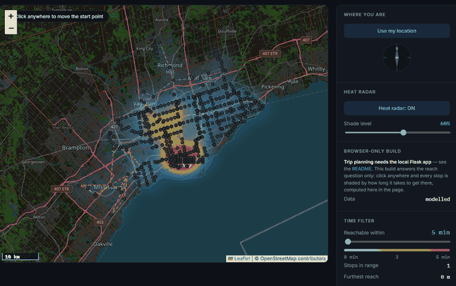

# Toronto Transit Reach

[](https://github.com/luke-zhang-cs-py/Toronto-Transit-Distance-Matrix/actions/workflows/python-package-conda.yml)
[](LICENSE)
[](https://www.python.org/)

How far can you get from any point in Toronto in 30 minutes? Click the map and
find out — plus how to make a specific trip, and what time you'd actually arrive.

### ▶ [Try it now — runs in your browser, nothing to install](https://luke-zhang-cs-py.github.io/Toronto-Transit-Distance-Matrix/app/)



*Above: the reach window widening from 5 to 60 minutes. Every stop is shaded by
how long it takes to get there — computed live, in the page.*

**[Read the full write-up →](https://luke-zhang-cs-py.github.io/Toronto-Transit-Distance-Matrix/)**
— where each number comes from, the graph it searches, and every bug this has
had. (Or open [`docs/index.html`](docs/index.html) locally.)

## Run it

```bash
pip install -r requirements.txt
python app.py                      # http://127.0.0.1:5000
python tools/build_schedule.py     # optional: adds timetabled departures
```

No API key, no billing account. OpenStreetMap tiles in the browser; every
travel time is computed locally against TTC's own open timetable and live feed.

## How it runs with no server

The live demo above is [`docs/app/`](docs/app/index.html) — the same page with
the server taken out. The graph is small enough (97 KB) to inline into the page,
and the reachability search is a port of `trips/routing.py`'s Dijkstra that runs in
JavaScript. It's generated, not hand-forked:

```bash
python tools/build_static.py
```

The build refuses to write if the JS port and the Python disagree at any of the
516 stops. Two things it deliberately doesn't do: waits are **modelled** rather
than measured, since GTFS-realtime needs a backend to fetch it, and there's no
trip planner — an approximated arrival time is worse than none. Run the Flask
app for both.

## Every wait says where it came from

Three kinds of number share one screen and they don't deserve equal trust, so
each one is labelled:

| Source | Means | Covers |
|---|---|---|
| **timetable** | the next actual departure | subway + 6 streetcar routes |
| **headway** | half the observed gap, live | surface routes |
| **modelled** | half an assumed headway | YRT, MiWay, GO |

Live service alerts apply on top — a closed line drops out of the graph, so
trips route around it.

## Layout

```
app.py        the Flask entry point, and the only module left in the root
network/      the graph: subway, streetcars, buses, regional, and the
              add_node / add_edge primitives they all use
feeds/        what TTC publishes: the GTFS archive, the departure index
              built from it, and the live vehicle feed
trips/        coordinates and a graph in, travel times and itineraries out
tools/        the two GTFS builders, the browser build, the figure refresh
```

Data in, graph, routes out — and the arrows only point one way, so `feeds/`
never imports `trips/`. `feeds/schedule.py` resolves the departure index two
levels up, because getting that wrong does not raise: the departures simply
stop being found, the suite skips instead of failing, and the app falls back
to average headways as though no timetable had ever been built.

`notes/` holds the long-form write-ups — `CODE_AUDIT.md` — and
`CONTRIBUTING.md` is in `.github/`, which is where GitHub looks for it.

## Tests

```bash
pytest -q
```

220 tests, 100% of 1,015 statements — and that figure is itself checked, because
it had already gone stale once. The suite never touches the network: the
realtime tests run against recorded feeds, one containing a real Line 2 closure.

## License

[MIT](LICENSE) — see [CONTRIBUTING.md](.github/CONTRIBUTING.md) for setup and test conventions.
